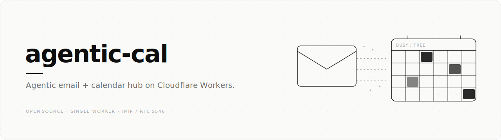

# agentic-cal



**Agentic email + calendar hub on Cloudflare Workers.** One Worker owns your domain's email surface: a full self-hosted email client with an AI agent, plus a unified calendar that aggregates Proton / Outlook / iCloud into one busy/free model and writes time blocks back to all three, using nothing but standards-compliant email invitations. No OAuth, no CalDAV, no provider APIs.

[](https://deploy.workers.cloudflare.com/?url=https://github.com/talalakkari/agentic-cal)

Forked from [cloudflare/agentic-inbox](https://github.com/cloudflare/agentic-inbox) (Apache 2.0) as a chassis: cloned, renamed, owned. Not tracked against upstream.

**In one paragraph:** the read path polls each provider's secret ICS publish link every 10 minutes (conditional GETs via KV, raw snapshots to R2) and expands everything (recurrence rules, exceptions, timezones) into a unified busy/free model in a Durable Object. The write path is RFC 5546 over RFC 6047: blocking time emails a standards-compliant invitation to each account, the native client renders a normal meeting invite, and the acceptance (`METHOD:REPLY`) routes back into the same Worker's `email()` handler where a Cloudflare Workflow tracks per-account acceptance. Clients accept; providers do the writing.

## What it does

- **Full email client.** Send and receive via Cloudflare Email Routing; rich text composer, threading, folders, search, attachments. Each mailbox is an isolated Durable Object (SQLite) with R2 for attachments.
- **Unified calendar (read).** Each provider publishes a read-only ICS feed (Proton "share via link", Outlook "publish calendar", iCloud "public calendar"). A cron poller normalizes all of them (RRULE expansion, EXDATE, RECURRENCE-ID overrides, timezones) into one availability model (served ±12 months past and future) with per-feed staleness warnings.
- **Calendar write path (iMIP).** `block_time` emails an RFC 5546/6047 invitation to each account; native clients render a normal meeting invite; acceptances route back into the same Worker and a Cloudflare Workflow tracks the lifecycle (send, wait, nag, finalize) per block.
- **MCP server.** `/mcp` behind Cloudflare Access exposes **23 tools** (13 email + 10 calendar: `get_availability`, `find_free_slots`, `block_time`, `get_block_status`, `cancel_block`, `delete_block`, `purge_cancelled_blocks`, `list_blocks`, `list_calendar_events`, `list_calendars`) for external agents such as Claude Code, Hermes, or anything speaking MCP, authenticated with an Access service token.
- **Built-in AI agent.** Chat panel with a 19-tool surface (9 email + 10 calendar, overlapping but not identical to the 23 exposed over `/mcp`), powered by Workers AI (default `@cf/google/gemma-4-26b-a4b-it`, swappable via the `AGENT_MODEL` var) with all model traffic routed through **AI Gateway**. Auto-drafts replies to inbound email, and checks real availability before answering scheduling emails. Drafts always require explicit confirmation before sending.
- **Calendar UI.** `/calendar` workspace with three tabs (Calendar, Feeds, Time blocks): a month/week/day view, paste-the-link feed registration and health, and a filterable time-blocks list showing per-block acceptance state (✓ ✗ ~ …) with one-click cancel and purge of cancelled blocks.

## How it works

Three flows carry the whole system. The **read path** folds three providers into one busy/free model; the **write path** blocks time using nothing but email; and **inbound dispatch** routes every message by its content, never by its address.

**Read path: three calendars into one busy/free model**


**Write path: blocking time by email (iMIP, RFC 5546 over RFC 6047)**


**Inbound dispatch: route on the message, never the address**


## Stack

- **Frontend:** React 19, React Router v7, Tailwind CSS, Zustand, TipTap, `@cloudflare/kumo`
- **Backend:** Hono, Workers, Durable Objects (SQLite), Workflows, R2, KV, Email Routing + Email Service, cron triggers
- **Calendar:** `ical.js` (parsing/expansion), hand-rolled RFC 5545 authoring, `mimetext` envelopes
- **AI:** Cloudflare Agents SDK (`AIChatAgent`), AI SDK v6, Workers AI via AI Gateway (`AGENT_MODEL` / `AI_GATEWAY_ID` vars)
- **Auth:** Cloudflare Access JWT validation (fails closed in production)

## Deploy

### One-click

The **Deploy to Cloudflare** button above provisions the Worker plus its resources (Durable Objects, the `block-time` Workflow, R2 buckets, KV namespace, cron trigger, Workers AI) on your account and prompts you for your domain values.

**The button cannot do everything.** Finish with these manual steps, in order:

1. **Cloudflare Access:** enable one-click Access on the Worker; set the `POLICY_AUD` + `TEAM_DOMAIN` secrets from the modal. The app intentionally returns 500 until this is done. Create a service token for any MCP agent.
2. **AI Gateway:** create a gateway matching the `AI_GATEWAY_ID` var (default `t9-agentic-cal`), or set the var to `""` to call Workers AI directly.
3. **Email Routing:** on your domain, add a catch-all rule → this Worker; enable Email Service for sending; add your calendar invite addresses as **verified destination addresses**.
4. **Vars:** set `DOMAINS` to your domain and `ORGANIZER_ADDR` to `calendar@<your-domain>`. This single address is *both* the meeting organizer and a normal monitored inbox: dispatch routes RSVPs to the calendar path and everything else to the inbox by payload + UID (never by address), so ordinary mail to it is never swallowed.
5. **Feeds:** open `/calendar` and paste your three ICS publish links (table below).

### Manual / local

```bash
npm install
npm run dev        # local dev (uses .dev.vars, see .dev.vars.example)
npm run typecheck  # cf-typegen + react-router typegen + tsc -b, run before every push
npx tsx scripts/smoke-ics.ts && npx tsx scripts/smoke-availability.ts && npx tsx scripts/smoke-imip.ts
```

Cloning manually instead of using the button? Create your own KV namespace (`wrangler kv namespace create calendar-feed-cache`) and R2 buckets (`agentic-inbox`, `calendar-snapshots`), and put your KV id in `wrangler.jsonc`. Then deploy with `wrangler deploy`.

## Registering calendar feeds

Open **`/calendar`** (button on the Mailboxes page). One card per provider: paste the publish link, set the invite address, save, hit **Poll now**:

| Provider | Where to generate the link | Recommended detail |
|---|---|---|
| Proton | Proton Calendar → Settings → **Share calendar via link** | full |
| Outlook (M365) | Settings → Calendar → Shared calendars → **Publish a calendar** → ICS | busy-only (Microsoft caches; feed lags hours) |
| iCloud | Apple Calendar → calendar info → **Public Calendar** → copy `webcal://` link | full |

- `webcal://` URLs are converted automatically; stored publish URLs are write-only secrets (only a truncated form is ever echoed).
- The **invite email** per feed is where iMIP invitations are sent (usually the account's own address).
- The cron repolls every 10 minutes; a failing feed keeps its last good data and surfaces the error on the card and in `feed_warnings`.

API equivalents (behind Access): `GET/POST /api/v1/calendar/feeds`, `DELETE /api/v1/calendar/feeds/:id`, `POST /api/v1/calendar/poll`, `GET /api/v1/calendar/stats`, `GET /api/v1/calendar/events`, `GET /api/v1/calendar/blocks`, `DELETE /api/v1/calendar/blocks/:uid` (`?purge=1` to delete as well as cancel), `POST /api/v1/calendar/blocks/purge-cancelled`.

## Connecting an agent over MCP

```
Endpoint:   https://<your-worker>/mcp
Auth:       CF-Access-Client-Id / CF-Access-Client-Secret (Access service token)
```

All 22 tools are self-describing over MCP (`list_tools` returns full schemas and usage guidance). Semantics worth knowing up front: `block_time` is **asynchronous**; it returns `pending` immediately (the slot counts as busy right away) and refuses with a conflict list unless `force` is set; acceptance per account is tracked by a Workflow and read via `get_block_status`. Tool responses include `feed_warnings` when a calendar feed is stale or erroring, so agents should hedge availability statements accordingly, and should never state availability without a same-turn tool call.

## Trust model

Any principal passing the shared Cloudflare Access policy can access **all** mailboxes and the calendar, including via `/mcp` (tools take a `mailboxId` parameter). There is no per-mailbox authorization; the Access policy is the single trust boundary. The same grant includes setting each mailbox's **agent system prompt** (Settings → it is fed verbatim to the model), so the Access boundary also governs what the agent is instructed to do. This is fine for a single operator. Before any multi-person use, put the app behind a properly-scoped team Access app: otherwise every principal reaches every mailbox and can rewrite the agent's instructions.

**Untrusted email content is structurally isolated.** Email subjects and bodies are attacker-controlled, so when the read tools (`get_email`, `get_thread`, `search_emails`) hand message content to the agent or to an MCP client, that content is wrapped in nonce-keyed data fences and labelled untrusted, so the model treats it as data rather than instructions. The autonomous auto-draft path additionally runs an AI prompt-injection scanner and fails closed.

## Troubleshooting Access

- `Invalid or expired Access token` → `POLICY_AUD` or `TEAM_DOMAIN` secret is stale. Toggle Access off/on for the Worker to get the modal again, and reset both secrets.
- `Cloudflare Access must be configured in production` → intentional fail-closed behavior; enable Access and set the secrets.

## Architecture


## License

Apache 2.0. See [LICENSE](LICENSE). Derived from [cloudflare/agentic-inbox](https://github.com/cloudflare/agentic-inbox), © Cloudflare, Inc.
